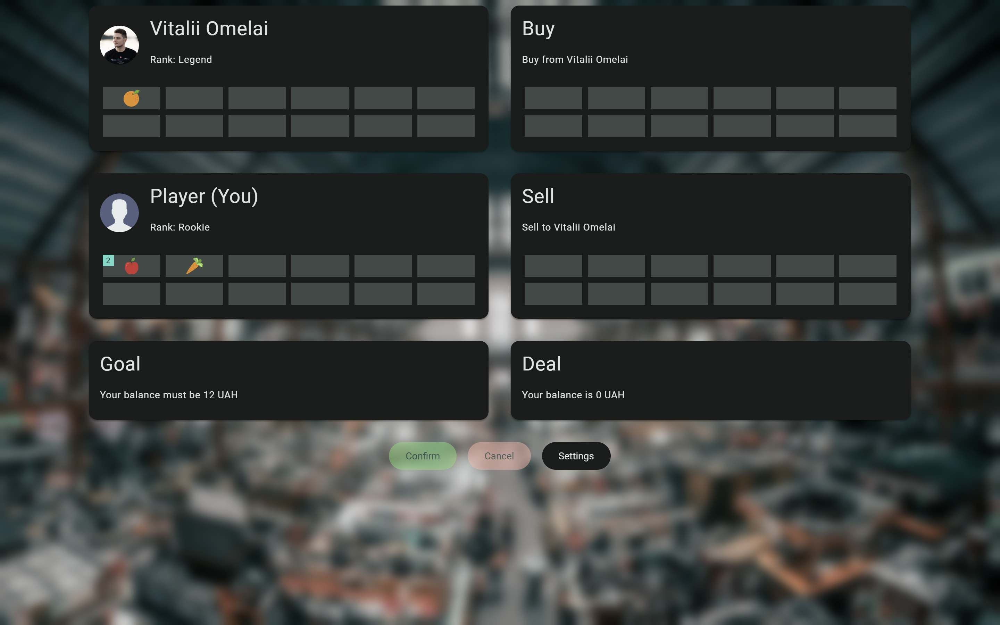
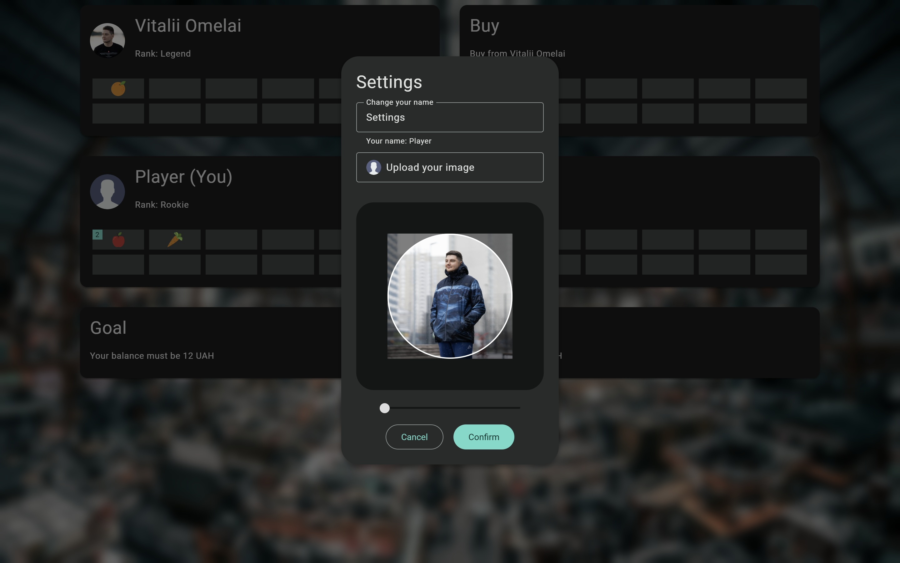

## Overview

A shop on **Django** using **Terraform**, **Docker** & **Docker Compose**. Inspired by **S.T.A.L.K.E.R.**

## Pages

### Loading

### Game

### Settings

### Congratulations

## Commands

### Initialize

- `cd scripts`
- **Command Prompt or PowerShell**:`.\initialize.bat`
- **macOS or Linux Terminal**: `source initialize.sh`

### Venv

- `python -m venv venv`
- **Command Prompt**: `.\venv\Scripts\activate`
- **PowerShell**: `.\venv\Scripts\Activate.ps1`
- **macOS or Linux Terminal**: `source venv/bin/activate`
- `deactivate`

### Pip

- `pip list`
- `pip freeze > requirements.txt`
- `pip install -r requirements.txt`
- `pip uninstall -r requirements.txt -y`

### Django

- `python populate.py`
- `python manage.py test apps`
- `python manage.py test apps core`
- `python manage.py makemigrations`
- `python manage.py migrate`
- `python manage.py collectstatic`
- `python manage.py createsuperuser`
- `python manage.py runserver`

### Docker

- `docker ps -a`
- `docker system prune -a`

### Docker-compose

- `docker-compose build`
- `docker-compose up -d`
- `docker-compose ps -a`
- `docker-compose logs`
- `docker-compose down -v`

### Choco

- `choco install terraform`

### Terraform

> [!NOTE]  
> The `local-exec` provisioner commands are intended to run on Windows.

- `terraform fmt -recursive`
- `terraform -chdir=terraform init`
- `terraform -chdir=terraform plan`
- `terraform -chdir=terraform apply`
- `terraform -chdir=terraform destroy`
